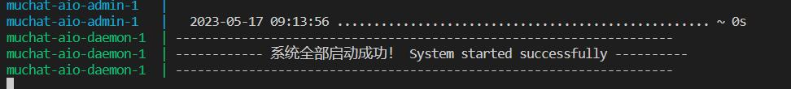

# Muchat
团队版 ChatGPT Web 应用，多用户，免登录。适合公司、组织或小团体内部使用。  
Team version of ChatGPT web application- multi-user and no log-in required. Suitable for internal use in companies, organizations or small groups.    
> See [English](./README_en.md)

> *有人乍一看目录觉得只是发布了个 exe，但实际代码在各个子仓库中，本仓库只是一个入口*

- [加入交流群](#技术交流群)  
- [定制功能联系](#技术交流群)  
- [捐赠](#捐赠)  

## 特性
- 无需登录，输入卡密即可使用
- 支持匿名试用，可设置试用次数
- 支持上下文
- 支持敏感词过滤
- 支持多分站
- 支持限制用户使用次数、有效期
- 支持多个 API-KEY
- 支持后台查看用户使用量
- 支持预设Prompt

# 安装教程：Docker 开发环境搭建（推荐）

硬件环境：
- 推荐 [DigitalOcean](https://m.do.co/c/d353e23d928f)(新用户送200刀，白嫖！) ，或者 [阿里云香港](https://www.aliyun.com/daily-act/ecs/activity_selection?userCode=d3lnfvg1) 
- 1核2G以上

软件依赖：
- 如果是大陆境内，需要**科学环境**
- 系统推荐用 Ubuntu ，后面的命令也基于 Ubuntu

以下命令在 [DigitalOcean](https://m.do.co/c/d353e23d928f) 1C2G VPS 上确认无误。  

ssh 登录到服务器，输入以下命令：

```bash
# 首先安装 Docker
curl -fsSL https://get.docker.com -o get-docker.sh
sh get-docker.sh

# 安装本项目
mkdir -p /var/www/muchat && cd /var/www/muchat

git clone https://github.com/panyanyany/muchat-aio.git
cd muchat-aio
cp .env.example .env # 如果你是在服务器部署，把 .env 里的 REACT_APP_API_ENDPOINT 替换成你的IP或域名
sudo docker compose up
# Ctrl + C 停止整个系统
```

> 更多命令参考：[常用命令](./docs/常用命令.md)  
  

- 当控制台出现如下提示，表示启动成功：


- 访问 Web UI： http://localhost:3000  
- 访问 管理后台： http://localhost:8000/admin
    - 账号：admin@admin.com
    - 密码：admin
    - 注意：记得改密码

# 基本操作
## 添加 API-KEY
打开 http://localhost:8000/admin/muchat/open_ai_accounts/create

填写2个必填字段：


## 添加卡密
打开 http://localhost:8000/admin/muchat/muchat_users/create

单击【生成】自动生成 slug 作为用户登录的唯一凭证（即激活码）


剩下3项非必须，不填则不限制：
- Max usage: 最大提问次数
- Max days: 最大有效天数（自激活时算起，不激活则不计算）
- Expires at: 过期时间，当用户第一次使用时，会根据 Max days 自动计算

## 接入发卡平台，或引流到私域
> 不需要可跳过

- 注册 [快发卡账号](http://www.kuaifaka.net/invitied?code=23957281)
- 编辑 `muchat-react/src/config/agents.ts`
- 假设你的域名为 example.com 或者 1.1.1.1:3000
```javascript
    'example.com': {
        adLink1: '你的快发卡链接',
    },
    '1.1.1.1:3000': {
        adLink1: '你的快发卡链接',
    },
```
效果如下：  


  
- 如果你只是想留微信，可以这样：
```javascript
    'example.com': {
        wechat: '你的微信',
    },
    '1.1.1.1:3000': {
        wechat: '你的微信',
    },
```
效果如下：  


## 使用（用户侧）
打开 http://localhost:3000/


这里的激活码，就是刚刚生成的 slug  

> 注意：这个位置可以插入购买链接。

## 最终用户界面


## 预设Prompt界面

- 底部状态栏  


- 设置和编辑预设Prompt  


## 使用国内中转API
打开 `docker-compose.yml`
将 `AP_BASE_URL=https://api.openai.com/v1/` 替换成中转链接，注意尾部的斜杠也要带上

## 升级更新
```
# Ctrl + C 结束 docker compose
git pull
docker compose up
```

# 常见问题
## 系统临时维护中


原因：后台缺少可用 OpenAI 账号

## 点某个链接/按钮没反应

关闭代理试试

# TODO
- [ ] 可保存聊天记录
- [ ] 支持多个对话
- [ ] 支持按 Token 计费
- [ ] 支持 stream
- [ ] 支持AI绘画
- [ ] 接入支付

# 技术交流群

> 广告勿扰，包括但不限于硬广、昵称广告、纯营销号

添加好友，请备注【Muchat进群】或【Muchat定制】：  
  


# 捐赠


